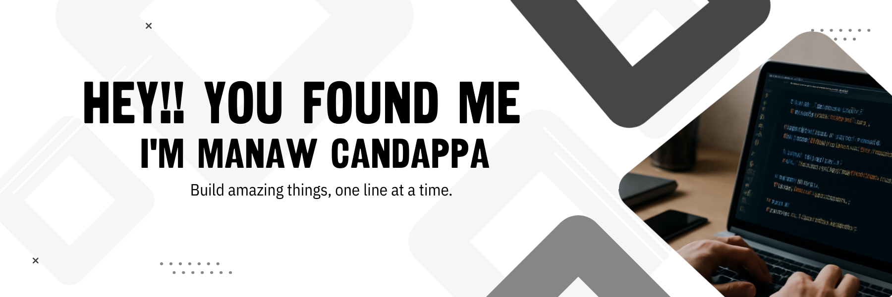

  

<h3 align="center">Aspiring Full-Stack & Mobile Developer | Web, Cross-Platform & Native Apps</h3>

  

<!-- About Me Section -->
<h3 align="left">About Me</h3>

Hi! 👋 I’m an undergraduate developer passionate about building modern, user-friendly applications. I enjoy transforming ideas into real projects and learning new technologies to stay ahead in the fast-paced world of software development.

<h3 align="left">What I Do</h3>
<ul>
  <li>🌐 Web Development: React, Node.js, Firebase</li>
  <li>📱 Mobile Development: Flutter, React Native, Native Android/iOS</li>
  <li>🎨 UI/UX & Responsive Design</li>
</ul>

<h3 align="left">Languages and Tools:</h3>

                               

<h3 align="left">Why Connect With Me</h3>
<ul>
  <li>Completed real-world projects showcasing problem-solving skills</li>
  <li>Quick learner, ready to contribute to web & mobile applications</li>
  <li>Seeking opportunities to grow, collaborate, and innovate</li>
</ul>

  

&nbsp;

